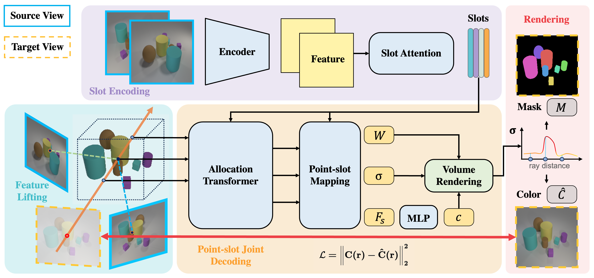

# SlotLifter
<p align="left">
    <a href='https://arxiv.org/abs/2408.06697'>
      
    </a>
    <a href='https://arxiv.org/pdf/2408.06697'>
      
    </a>
    <a href='https://slotlifter.github.io/'>
      
    </a>
</p>

This repository contains the official implementation of the ECCV 2024 paper:

[SlotLifter: Slot-guided Feature Lifting for Learning Object-centric Radiance Fields](https://arxiv.org/abs/2408.06697)

[YuLiu](https://yuliu-ly.github.io)\*，[Baoxiong Jia](https://buzz-beater.github.io)\*，[Yixin Chen](https://yixchen.github.io), [Siyuan Huang](https://siyuanhuang.com)
<br>
<p align="center">
     </img>
</p> 

## Environment Setup
We provide all environment configurations in ``requirements.txt``. To install all packages, you can create a conda environment and install the packages as follows: 
```bash
conda create -n slotlifter python=3.8
conda activate slotlifter
conda install pytorch==2.1.0 torchvision==0.16.0 torchaudio==2.1.0 pytorch-cuda=12.1 -c pytorch -c nvidia
pip install -r requirements.txt
```
In our experiments, we used NVIDIA CUDA 12.1 on Ubuntu 22.04. Similar CUDA version should also be acceptable with corresponding version control for ``torch`` and ``torchvision``.

## Dataset
### 1. CLEVR567, Room-Chair, Room-Diverse
CLEVR567, Room-Chair, and Room-Diverse datasets are provided by [uORF](https://github.com/KovenYu/uORF). 

### 2. Room-Texture, Kitchen-Matte, Kitchen-Shiny
Room-Texture, Kitchen-Matte, and Kitchen-Shiny datasets are provided by [uOCF]([https://github.com/KovenYu/uORF](https://github.com/Red-Fairy/uOCF-code). 

### 3.ScanNet
Coming soon.
### 4.DTU
Coming soon.

## Training & Evaluation
We provide training and testing scripts under ```scripts/``` for all datasets. 
- ```train_uorf_data.sh``` and ```eval_uorf_data.sh```: CLEVR567, Room-Chair, Room-Diverse, Room-Texture, Kitchen-Matte, and Kitchen-Shiny dataset
- ```train_scannet.sh``` and ```eval_scannet.sh```: Scannet dataset
- ```train_dtu.sh``` and ```eval_dtu.sh```: DTU dataset

## Citation
If you find our paper and/or code helpful, please consider citing:
```
@inproceedings{Liu2024slotlifter,
  title={SlotLifter: Slot-guided Feature Lifting for Learning Object-centric Radiance Fields},
  author={Liu, Yu and Jia, Baoxiong and Chen, Yixin and Huang, Siyuan},
  booktitle={European Conference on Computer Vision (ECCV)},
  year={2024}
}
```

## Acknowledgement
This code heavily used resources from [PanopticLifting](https://github.com/nihalsid/panoptic-lifting), [BO-QSA](https://github.com/YuLiu-LY/BO-QSA), [SLATE](https://github.com/singhgautam/slate), [OSRT](https://github.com/stelzner/osrt), [IBRNet](https://github.com/googleinterns/IBRNet), and [uORF](https://github.com/KovenYu/uORF). We thank the authors for open-sourcing their awesome projects.
